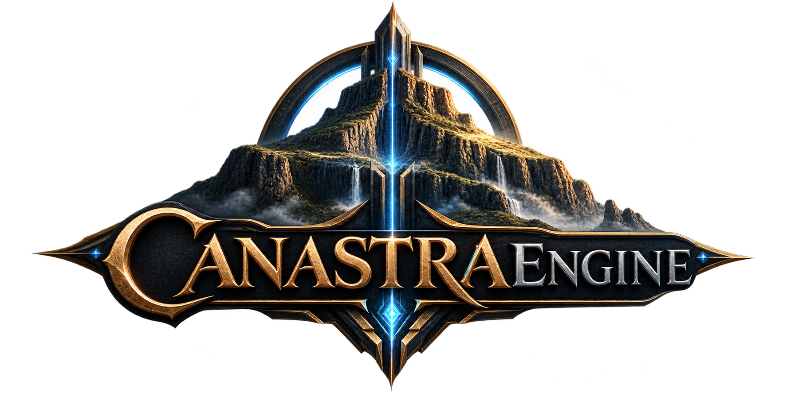
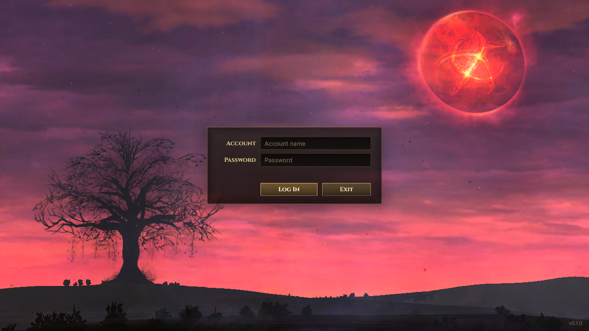

<p align="center"></p>

# CanastraEngine

Lineage 2 High Five client and servers in Rust. It reads assets straight from an existing H5 client
install; the `system` tables (`.dat`) are being migrated to Canastra's own data format. See
[`docs/decisions.md`](docs/decisions.md) for the agreed architecture and build order.

<p align="center"></p>

- **Try it:** [docs/getting-started.md](docs/getting-started.md) installs Rust and runs the servers, the
  client and Studio.
- **See it:** [docs/screenshots](docs/screenshots) shows the screens that work today.
- **Help build it:** read [CONTRIBUTING.md](CONTRIBUTING.md) and the [code of conduct](CODE_OF_CONDUCT.md).

## Architecture

Dependencies only point downward. Format crates are pure (`&[u8]` in, types out, no IO),
so they can be tested against synthetic bytes and reused by tools.

```
apps/        canastra-client     game client: winit + wgpu window drawing the UI (login screen for now)
             canastra-studio     game data editor (egui): validation blocks saving, undo, client icons, class kits
             canastra-cli        IO, filesystem, user-facing commands
             canastra-login      login server: accounts, rate-limited auth, game server registry, tickets
             canastra-game       game server: admits players by ticket, lists, creates and deletes their characters
crates/      canastra-migrate    legacy client tables + server XML -> game data, with a report
             ue2-assets          tagged properties, textures, palettes and static meshes read in place
             ue2-level           placed actors and scene cameras of a map
             canastra-data       game data domain model shared by client, server and Studio
             canastra-protocol   network messages per phase and direction (postcard, no IO)
             canastra-net        Noise-encrypted framed connections (tokio) and signed admission tickets
             canastra-db         PostgreSQL (sqlx) migrations and accounts with Argon2id passwords
             canastra-ui         UI markup + CSS subset laid out into draw commands (no GPU, no fonts)
             l2-catalog          finds client textures, static meshes and material textures by path
             l2-dat-h5           H5 .dat layouts (GPL-derived, migration tooling only)
             l2-dat              schema-driven decoder for the legacy system/*.dat tables
             ue2-package         UE2 package tables: names, imports, exports, object paths
             ue2-core            bounds-checked binary reader (compact index, FString, UTF-16)
             l2-crypto           Lineage2Ver111 / 121 (XOR) and 413 (RSA + zlib)
             l2-env              Env.int and TimeEnv time-of-day color ramps
```

## Commands

```
cargo run --release -p canastra-cli -- scan    "<H5 client root>"
cargo run --release -p canastra-cli -- package "<file>.utx"
cargo run --release -p canastra-cli -- dat     "<file>.dat"
cargo run --release -p canastra-cli -- texture "<file>.utx" Group.Name out.png
cargo run --release -p canastra-cli -- decrypt "<file>.dat" out.bin
cargo run --release -p canastra-cli -- level   "<client>/MAPS/lobby01.unr"
cargo run --release -p canastra-cli -- mesh    "<client>/Animations/Fighter.ukx" MFighter_anim
cargo run --release -p canastra-studio -- gamedata.cana "<H5 client root>"
cargo run --release -p canastra-cli -- migrate "<H5 client root>" "<server>/data/stats" gamedata.cana
```

Login server (PostgreSQL from `docker compose up -d postgres`):

```
cargo run -p canastra-login -- keygen                      # paste into canastra-login.toml (see the example)
cargo run -p canastra-login -- create-account <name>       # password from CANASTRA_PASSWORD or stdin
cargo run -p canastra-login -- serve
```

Game server (authorize its key in the login server's `[[authorized]]`):

```
cargo run -p canastra-game -- keygen                       # paste into canastra-game.toml (see the example)
cargo run -p canastra-game -- serve
```

`scan` on a real H5 client: 3020 of 3021 files decrypt, 1244 packages parse, and all 54 `system`
tables decode with every byte accounted for. The one failure (`Animations/RTA63900`) is a
corrupt leftover file.

## Guards

Enable the pre-commit hook once per clone:

```
git config core.hooksPath .githooks
```

It runs `cargo fmt --check`, `cargo clippy -D warnings` and `cargo test`. Lints live in the
workspace `Cargo.toml`: `unsafe` is forbidden, clippy `all` is denied, `pedantic` warns, and
`unwrap`/`panic`/`todo` are denied outside tests, because client files are untrusted input.

## Format notes (verified against the client)

- Header: `Lineage2VerXXX` in UTF-16LE (28 bytes). Optional 20-byte trailer `[0, ?, ?, crc32, 0]`.
- Ver111: XOR `0xAC`. Ver121: XOR with the low byte of the sum of the lower-cased file name.
  On XOR files the trailer is stripped only when its CRC matches (custom encoders omit it).
- Ver413: 128-byte RSA blocks (NCsoft and l2encdec public keys), each `[0,0,0,size,...data]`,
  concatenating to `u32 size` + zlib. Block alignment tells whether the trailer exists.
- Packages: tag `0x9E2A83C1`, versions 117 to 128. An export's offset is present when `SerialSize != 0`.
- Tables: a `u32` record count, records, then the `FString` `SafePackage`. H5 layouts live in
  `crates/l2-dat-h5`; `RideData` had no public layout and was derived from the file.

## License

CanastraEngine is under the [Canastra Source License](LICENSE): it may be used, modified and shared for
free, and game servers built with it may earn money, but the engine itself may not be sold. Extensions such
as plugins, scripts and content packs belong to their authors and may be sold.

53 of the H5 layouts derive from the GPL-licensed L2ClientDat descriptors. They are isolated in
`l2-dat-h5`, under GPL-3.0, which only migration tooling may depend on; the client, server and Studio must
not. Lineage II is a trademark of NCSOFT; this project is not affiliated with NCSOFT and ships no client
files.
