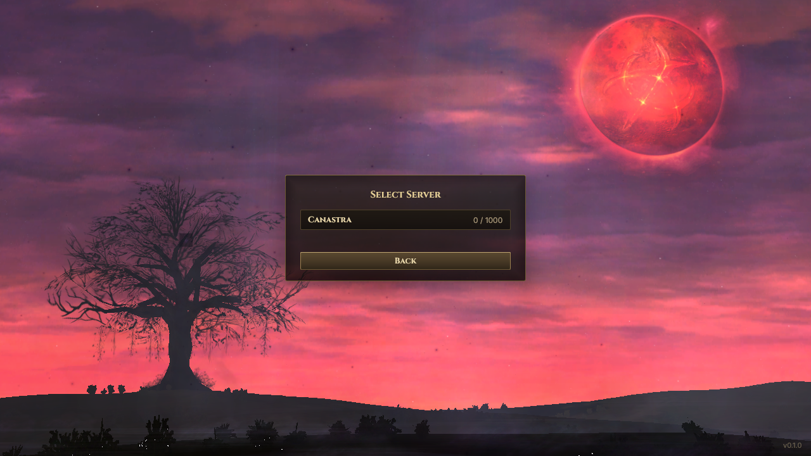
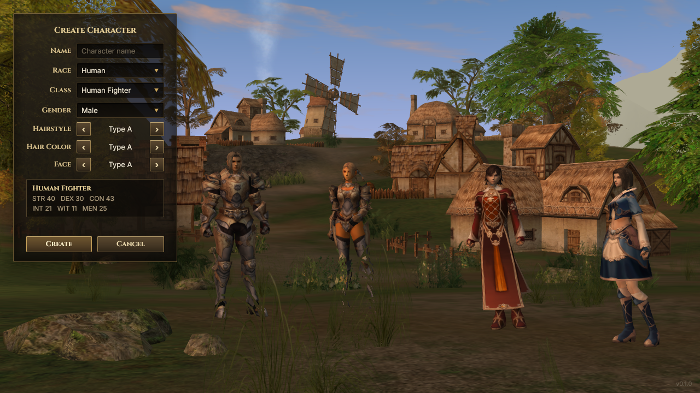
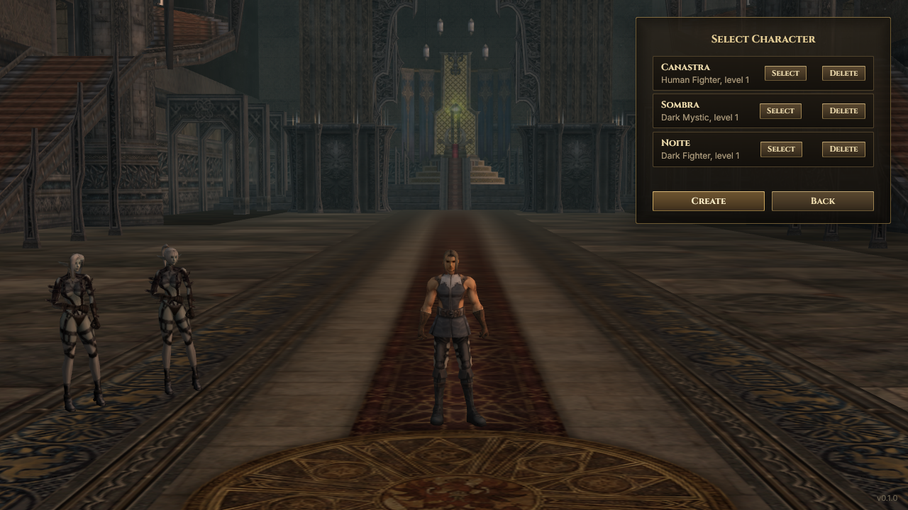
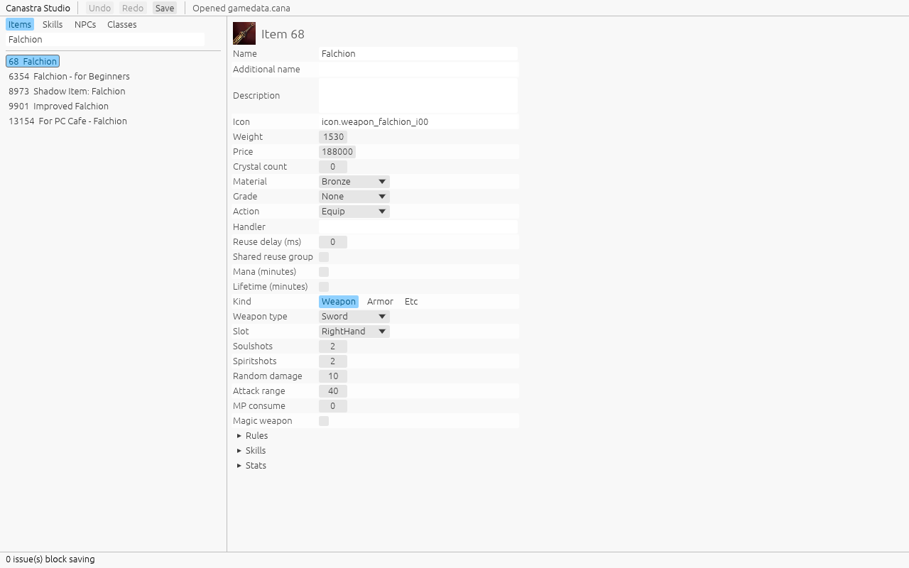
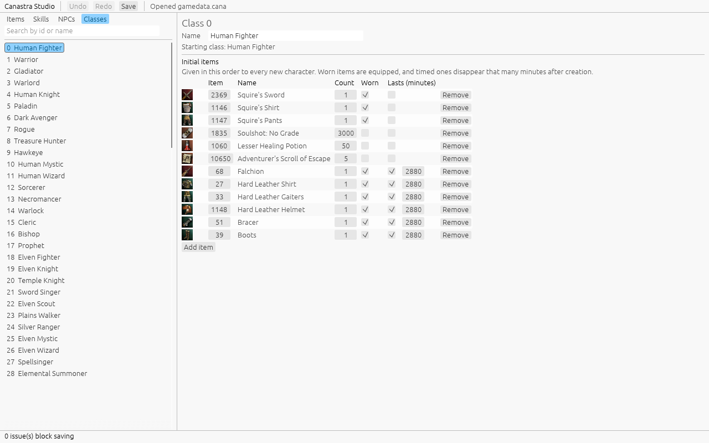

# Screenshots

Screens that work today, captured from the running client and Studio (2026-09-15).

| | |
| --- | --- |
|  | **Login.** The High Five login scene, drawn from the installed client's own map, particles and sky. |
|  | **Server list.** Game servers registered with the login server, with their population. |
|  | **Character creation.** Talking Island from Lobby02, with the race's characters in display armor. Race, class and gender combos; hair style, hair color and face steppers change the chosen model. |
|  | **Characters.** The account's characters standing in the lobby hall, the selected one on the rune circle, with select and delete. |
|  | **Studio: items.** The game data editor with client icons, validation and undo. |
|  | **Studio: starting kit.** Each class's initial items, which the server owner decides. |

How the select and creation scenes follow H5 is in [character-scenes.md](../character-scenes.md).
